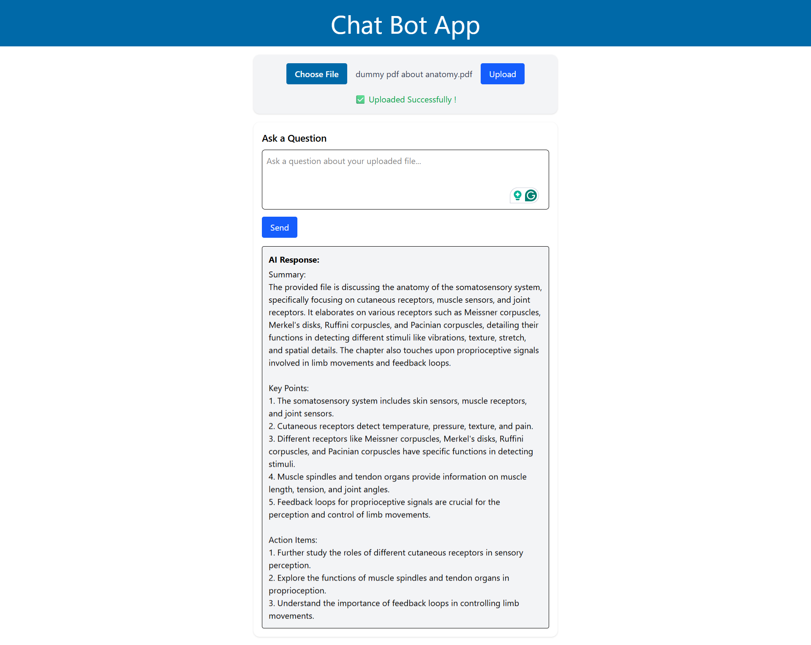

# Chat Bot App

An intelligent document assistant that allows you to **upload PDF or DOCX files** and ask natural language questions. The app returns **AI-generated structured answers** using OpenAI-compatible APIs.

Designed for speed, clarity, and minimalism — great for both demos and real-world usage.

---

## 1️⃣ Preview



---

## Features

- Upload `.pdf` or `.docx` documents
- Ask questions and receive AI answers
- Uses OpenAI-compatible models (via OpenRouter, HuggingFace)
- Server-side file parsing (PDF, DOCX)
- Backend vector storage and retrieval using Langchain
- Simple, fast, and responsive UI with Tailwind CSS

---

## Tech Stack

### Frontend

- React + Vite – Modern SPA setup
- TypeScript – Static typing
- Tailwind CSS – Utility-first design
- Redux Toolkit – Global state (for document ID)

### Backend

- Express.js – REST API server
- Langchain – Chunking, embedding, and querying
- HuggingFace – Sentence-transformer embeddings (MiniLM-L6-v2)
- OpenRouter (OpenAI-compatible) – Chat API access
- Multer – File upload handling
- PDF & DOCX Parsing – Custom parsing for document ingestion
- RESTful JSON Response – Full answer delivered in a single response

---

## 2️⃣ Quick Start Guide

### Clone the Repository

```bash
git clone https://github.com/ThisIsOJAS/chat-bot.git
cd chat-bot
```

### Backend Setup (`/chat-bot-backend`)

```bash
cd chat-bot-backend
npm install
```

Create a `.env` file:

```env
HF_API_KEY=your_huggingface_key_here
OPENROUTER_API_KEY=your_openrouter_key_here
```

Run the backend:

```bash
npx tsx index.ts
```

Your backend will start on port 3001 by default.

### Frontend Setup (`/chat-bot-app-ui`)

```bash
cd ../chat-bot-app-ui
npm install
```

Create a `.env` file:

```env
VITE_BACKEND_URL=http://localhost:3001
```

Run the frontend:

```bash
npm run dev
```

Your app will be live on <http://localhost:5173> (remove angle brackets)

---

## 3️⃣ Folder Structure

chat-bot/
├── chat-bot-backend/
│ ├── embeddings/
│ ├── routes/
│ ├── services/
│ ├── utils/
│ └── index.ts
├── chat-bot-app-ui/
│ ├── components/
│ ├── store/
│ ├── utils/
│ └── main.tsx
└── preview.png

---

## Notes

- No database used — all documents are stored in-memory
- Uses structured prompts for consistent answers
- Streaming responses (SSE) were implemented but stashed for now. Current version focuses on reliability over partial rendering.
- Easily extendable with persistent vector stores.

---

## License

MIT — free for personal and commercial use.

---

## Author

Made with focus and learning by [Ojas Gupta](https://github.com/ThisIsOJAS)
